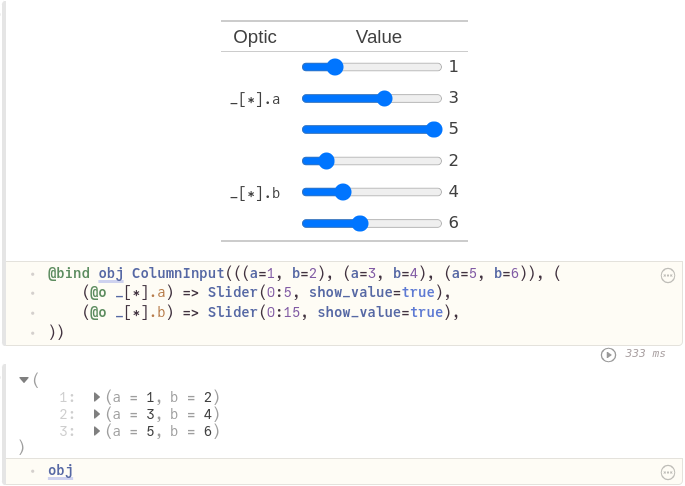

# PlutoTables.jl

Show and edit arbitrary Julia objects in a tabular interface. Based on `Pluto` and `PlutoUI` for interactivity, `Accessors` and `AccessorsExtra` for object modification.

Currently, the focus is specifically on tabular UIs for editing objects. \
For a basic example, this code:
```julia
@bind obj ColumnInput(((a=1, b=2), (a=3, b=4), (a=5, b=6)), (
	(@o _[∗].a) => Slider(0:5, show_value=true),
	(@o _[∗].b) => Slider(0:15, show_value=true),
))
```
creates this interface for `obj`:



See the [Pluto notebook](https://aplavin.github.io/PlutoTables.jl/examples/notebook.html) for more examples and details.

Note: tabular widgets can be especially convenient when put into a sidebar, see [PlutoUIExtra](https://gitlab.com/aplavin/PlutoUIExtra.jl) for a notebook sidebar widget.
